# Docker-Mail

Nitinan Keel </br>
Containerization of application and services </br>
Docker-Mail

## Table of contents
* [Concept](https://github.com/Nitikee/Docker-Mail#conecpt)
  * [Requierements](https://github.com/Nitikee/Docker-Mail#requierements)
  * [Networkdiagramm](https://github.com/Nitikee/Docker-Mail#networkdiagramm)
  * [DNS Records](https://github.com/Nitikee/Docker-Mail#dns-records)
  * [Setup folders and required files](https://github.com/Nitikee/Docker-Mail#setup-folders-and-required-files)
  * [Vagrantfile](https://github.com/Nitikee/Docker-Mail#vagrantfile)
  * [Dockerfile](https://github.com/Nitikee/Docker-Mail#dockerfile)
* [Installation](https://github.com/Nitikee/Docker-Mail#installation)
* [Connect with a client](https://github.com/Nitikee/Docker-Mail#connect-with-a-client)

## Concept

### Requirements:
* [Vagrant](https://www.vagrantup.com/downloads.html)
* [VirtualBox](https://www.virtualbox.org/wiki/Downloads)
* [Git](https://git-scm.com/download/win)
* [Vagrant plugin](https://github.com/leighmcculloch/vagrant-docker-compose)
* Client like [Thunderbird](https://www.thunderbird.net/de/)

### Networkdiagramm
```
                                      +------------------------+
                                      | SVMB1                  |
                    SMTP --> 25  +----+ 192.168.123.10/24      |
                    IMAP --> 143 |    | tandem2.nitinankeel.ch |
+-----------------+              |    +------------------------+
| Windows Client  +--------------+
| 192.168.123.2/24|              |    +------------------------+
+---------------- +              |    | SVMB2                  |
                                 +----+ 192.168.123.20/24      |
                                      | tandem1.nitinankeel.ch |
                                      +------------------------+
```
### DNS Records
```
 +-------------------------------------------------------------+
 | DNS Server                                                  |
 | ns1.hostserv.eu                                             |
 |                                                             |
 | A Record                                                    |
 | mail.tandem1.nitinankeel.ch ==> 192.168.1.10/24             |
 | mail.tandem2.nitinankeel.ch ==> 192.168.1.20/24             |
 | tandem1.nitinankeel.ch      ==> 192.168.1.10/24             |
 | tandem2.nitinankeel.ch      ==> 192.168.1.20/24             |
 |                                                             |
 | MX Record                                                   |
 | tandem1.nitinankeel.ch      ==> mail.tandem1.nitinankeel.ch |
 | tandem2.nitinankeel.ch      ==> mail.tandem2.nitinankeel.ch |
 +-------------------------------------------------------------+
```

### Setup folders and required files
```
. 
├── config                    # Config folder synced to both VM's (Required)
|   └── docker-compose.yml    # Docker-compose file (Required)
├── stuff                     # Folder for manual pics (Not required)
|   └── *.PNG                 # Manual PNG's (Not required)
├── .gitignore                # .gitignore file (Not required)
├── LICENSE (GPLv2)           # License (Not required) 
├── README.md                 # Readme file (Not required)
├── README.pdf                # PDF version from Readme file (Not required)
└── Vagrantfile               # Vagrant file (Required)
```
### Vagrantfile
```RUBY
# Vagrant box image. Only tested with trusty64!
BOX_IMAGE = "ubuntu/trusty64"
# 2 Mailserver. If you change this, you need to add or remove the DNS records!
WEB_COUNT = 2
# Start Vagrant configuration

Vagrant.configure("2") do |config|

  # Foreach Mailserver do:
  (1..WEB_COUNT).each do |i|

    # Install Docker and Docker-Compose on VM
    config.vm.provision :docker
    config.vm.provision :docker_compose

    # Set box image
    config.vm.box = BOX_IMAGE

    # Start subconfigurations
    config.vm.define "svmb#{i}" do |subconfig|

      # Set name like "svmb1"
      subconfig.vm.hostname = "svmb#{i}"

      # Host-Only-Network. If you change this, then change your DNS records!
      subconfig.vm.network :private_network, ip: "192.168.123.#{i}0"

      # Set "config" as synced folder to "/home/vagrant"
      subconfig.vm.synced_folder "config", "/home/vagrant"

      # Start inline shell
      subconfig.vm.provision "shell", inline: <<-SHELL

      # Create directory "docker-mail" in root
      mkdir /docker-mail

      # Change to directory
      cd /docker-mail

      # Copy docker-compose.yml from synced folder to docker-mail folder
      sudo cp /home/vagrant/docker-compose.yml /docker-mail/docker-compose.yml

      # Create .env file. DOMAINNAME must be equal to your DNS record!
      sudo echo "DOMAINNAME=tandem#{i}.nitinankeel.ch" > .env

      # Pull docker image
      sudo docker pull tvial/docker-mailserver:latest

      # Pull Setup.sh file and make it executable
      sudo curl -o /docker-mail/setup.sh https://raw.githubusercontent.com/tomav/docker-mailserver/master/setup.sh
      sudo chmod a+x /docker-mail/setup.sh

      # Create startfile.sh script. After the installing the VM, just execute this script.
      # It will create a user "testuser" for each domain / mailserver. Password is 1234
      sudo echo "/docker-mail/setup.sh email add testuser@tandem#{i}.nitinankeel.ch 1234 \ndocker-compose up -d mail" > startfile.sh

      # Make it executable
      sudo chmod +x /docker-mail/startfile.sh

      # End of inline script
      SHELL

      # Virtualbox settings
      subconfig.vm.provider "virtualbox" do |v|

        # Name of the VM
        v.name = "svmb#{i}"

        # Memmory in MB
        v.memory = 512

      end

    end

  end

end
```
### Dockerfile

Nothing special here.
```yaml
version: '2'

services:
  mail:
    image: tvial/docker-mailserver:latest
    hostname: mail
    domainname: ${DOMAINNAME} # This is a variable from the .env file! IP of this VM MUST equal the DNS record!
    container_name: mail
    ports:
    - "25:25"
    - "143:143"
    - "587:587"
    - "993:993"
    volumes:
    - maildata:/var/mail
    - mailstate:/var/mail-state
    - ./config/:/tmp/docker-mailserver/
    environment:
    - ENABLE_SPAMASSASSIN=0 # Disabled because it's just a dev environment 
    - ENABLE_CLAMAV=0 # Disabled because it's just a dev environment
    - ENABLE_FAIL2BAN=0 # Disabled because it's just a dev environment
    - ENABLE_POSTGREY=0 # Disabled because it's just a dev environment
    - ONE_DIR=1
    - DMS_DEBUG=0
    cap_add:
    - NET_ADMIN
    - SYS_PTRACE

volumes:
  maildata:
    driver: local
  mailstate:
    driver: local
```
## Installation
Clone the GIT repository.
```sh
git clone https://github.com/Nitikee/Docker-Mail.git
```
Start the VM with Vagrant (Don't forget the plugin in the requirements above!)
Get a coffee. This will take some time (Up to 30min. | Just a guess).
```sh
vagrant up
```
Connect to the VM with SSH. Standard password is "vagrant".
```sh
vagrant ssh svmb1 # Insert your VM name 
```
Execute the startfile.sh script. Must be done on every Server!
```sh
cd /docker-mail/
sudo ./startfile.sh
```
Your Mailserver is now running.

## Connecting with a Client
In my example I will use Thunderbird-Portable as a Client.
Create a new email account.
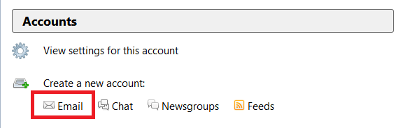
Use an existing email.
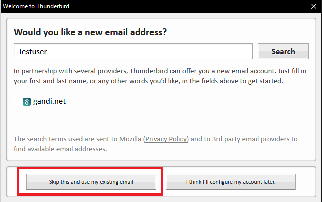
Insert Name (not relevant), Email address (testuser@tandem1.nitinankeel.ch), Password (1234) > Continue.
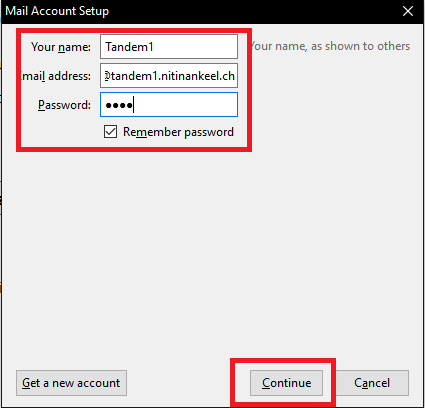
Wait and click Done.
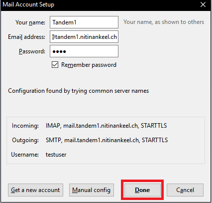
Because IMAP and SMTP will communicate over STARTTLS you need to confirm the certificate. 
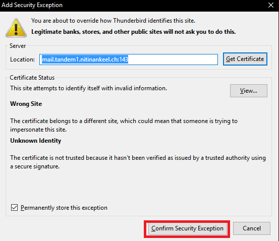
1 Mailaccount is now active. Do the same with the other(s).
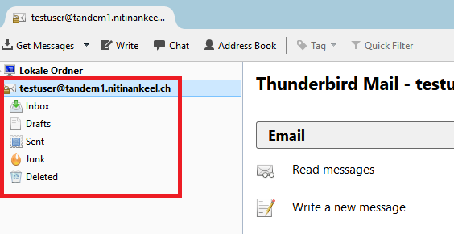
Write a mail and send.
Example: FROM testuser@tandem2.nitinankeel.ch TO testuser@tandem1.nitinankeel.ch
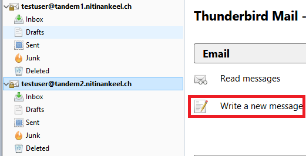
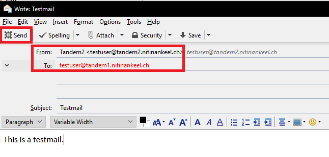
You will get an error because you need to confirm the certificate.
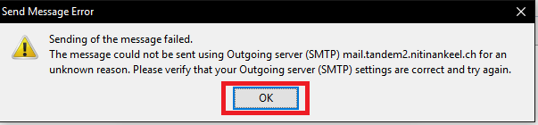
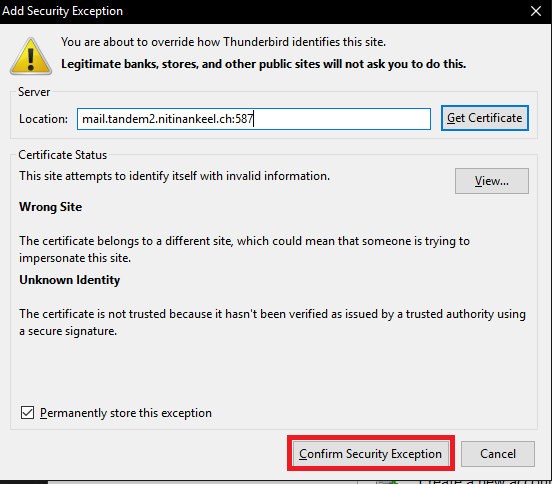
The other testuser should receive your mail any moment.
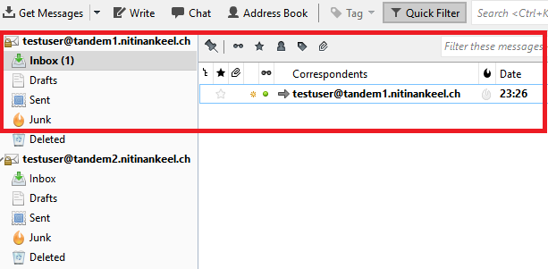

## Useful links
https://github.com/tomav/docker-mailserver
https://www.thunderbird.net/de/features/#getstarted
https://www.vagrantup.com/intro/getting-started/install.html
https://de.wikipedia.org/wiki/Simple_Mail_Transfer_Protocol
https://de.wikipedia.org/wiki/MX_Resource_Record
https://www.thomas-krenn.com/de/wiki/Netzwerkkonfiguration_in_VirtualBox